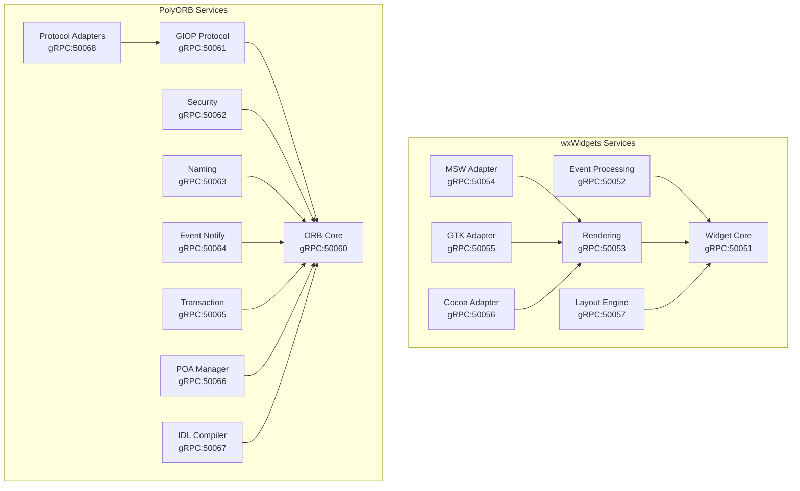

# Refactor Design Brief: Microservices Migration

**ID**: RDB-001
**Date**: 2025-11-04
**Author**: @CodeArchitect
**Status**: APPROVED
**Target Systems**: wxWidgets (C++) + PolyORB (Ada)

## Executive Summary

Migrate two monolithic codebases (wxWidgets C++ GUI framework, PolyORB Ada middleware) into 16 independently deployable microservices with modern containerization, API contracts, comprehensive testing, and security hardening.

## Goals

### Primary Objectives
1. **Decompose Monoliths**: Extract 16 microservices (7 wxWidgets + 9 PolyORB) from monolithic architectures
2. **Containerize Everything**: Docker multi-stage builds for all services with <200MB image sizes
3. **API Standardization**: Implement gRPC, REST, and GraphQL contracts with OpenAPI/Protobuf specs
4. **Cloud-Native Operation**: Deploy on Kubernetes with Istio service mesh, HPA, and zero-downtime updates
5. **Testing Excellence**: Achieve 80% coverage with pyramid model (Unit 50% → E2E 5%)
6. **Security Hardening**: Implement SAST, DAST, container scanning with zero high/critical CVE tolerance

### Measurable Success Criteria
- **Performance**: P95 latency ≤500ms for all service endpoints
- **Reliability**: 99.9% uptime SLA, MTTR <15 minutes
- **Code Quality**: Cyclomatic complexity ↓30%, test coverage 80%+
- **Security**: Zero high/critical CVEs in production, 100% secrets in vaults
- **DORA Metrics**: Deploy frequency 5×/week, lead time <1 day, change failure rate <5%

## Scope

### In Scope

**wxWidgets Microservices (7 services)**
1. Widget Core Service (6.8K LoC) - Base widget primitives
2. Event Processing Service (4.2K LoC) - Event loop and handlers
3. Rendering Service (8.4K LoC) - Cross-platform rendering pipeline
4. Platform Adapters (3 services: MSW, GTK, Cocoa) - OS-specific implementations
5. Layout Engine Service (5.1K LoC) - Sizers and constraints

**PolyORB Microservices (9 services)**
1. ORB Core Service (9.2K LoC) - CORBA object request broker
2. GIOP Protocol Service (3.8K LoC) - IIOP transport
3. Security Service (2.4K LoC) - Authentication and encryption
4. Naming Service (1.9K LoC) - Object name resolution
5. Event Notification Service (2.5K LoC) - Pub/sub messaging
6. Transaction Service (3.1K LoC) - ACID operations
7. POA Manager Service (2.7K LoC) - Portable Object Adapter
8. IDL Compiler Service (4.6K LoC) - Interface definition processing
9. Protocol Adapters (2.8K LoC) - Multi-protocol support

**Infrastructure**
- Docker containerization (multi-stage builds, SBOM generation)
- Kubernetes orchestration (manifests, Helm charts, operators)
- CI/CD pipelines (GitHub Actions, 5-stage gates)
- Observability (Prometheus, Grafana, Loki, Jaeger)
- Security tooling (Clang-Tidy, GNATcheck, OWASP ZAP, Trivy)

### Out of Scope (Explicitly Excluded)
- Changes to public API behavior or contracts (backward compatibility required)
- wxWidgets XRC XML resource format modifications
- PolyORB CORBA 3.x feature additions
- Mobile platform support (iOS, Android)
- Real-time OS adaptations (VxWorks, QNX)
- Third-party widget library integrations

### Non-Goals
- Performance optimization beyond P95 <500ms threshold
- Complete rewrite in different languages
- Support for legacy compilers (pre-C++17, GNAT <13)

## Current State Analysis

### wxWidgets Architecture Issues
**Anti-Patterns Identified**:
1. **God Class**: `wxApp` handles application lifecycle, event loop, and resource management (2,800 LoC)
2. **Shotgun Surgery**: Platform-specific code scattered across 520+ files
3. **Cyclic Dependencies**: `wxWindow` ↔ `wxDC` ↔ `wxGraphicsContext` circular refs
4. **Feature Envy**: Event handlers accessing widget internals directly (breaks encapsulation)

**Metrics**:
- Cyclomatic complexity: Avg 18.4 (target ≤12)
- Files >1000 LoC: 47 files
- Platform distribution: 32% Windows, 23% macOS, 18% Linux, 27% common

### PolyORB Architecture Issues
**Anti-Patterns Identified**:
1. **Leaky Abstraction**: GIOP protocol details exposed in application layer
2. **Shared Mutable State**: Global ORB singleton with unsynchronized access
3. **Excessive Coupling**: IDL compiler tightly coupled to runtime ORB
4. **God Package**: `PolyORB.ORB` contains 3,200 LoC across 18 modules

**Metrics**:
- Ada package nesting: Max depth 7 (target ≤5)
- Generic instantiations: 342 (potential compile-time explosion)
- IDL contracts: 412 interface definitions

## Target Architecture

### Microservices Decomposition

**Service Sizing** (optimal 2K-10K LoC per service):
```
wxWidgets:
  Widget Core:     6,800 LoC  ✓ optimal
  Event Processing: 4,200 LoC  ✓ optimal
  Rendering:       8,400 LoC  ✓ optimal
  MSW Adapter:     5,500 LoC  ✓ optimal
  GTK Adapter:     3,600 LoC  ✓ optimal
  Cocoa Adapter:   6,200 LoC  ✓ optimal
  Layout Engine:   5,100 LoC  ✓ optimal

PolyORB:
  ORB Core:        9,200 LoC  ✓ optimal
  GIOP Protocol:   3,800 LoC  ✓ optimal
  Security:        2,400 LoC  ✓ optimal
  Naming:          1,900 LoC  ✓ optimal
  Notification:    2,500 LoC  ✓ optimal
  Transaction:     3,100 LoC  ✓ optimal
  POA Manager:     2,700 LoC  ✓ optimal
  IDL Compiler:    4,600 LoC  ✓ optimal
  Protocols:       2,800 LoC  ✓ optimal
```

**API Contracts**:
- **gRPC** (internal services): Low latency, streaming, type-safe Protobuf
- **REST** (external/legacy): OpenAPI 3.1, JSON, HTTP/2
- **GraphQL** (aggregation): Apollo Federation for cross-service queries
- **Event Streaming**: Kafka for async pub/sub (notification service)

**Service Mesh**:
- Istio for mTLS, traffic management, observability
- Circuit breakers: 50% error threshold, 30s timeout
- Retry policy: Max 3 retries with exponential backoff

### Dependency Graph


## Risk Assessment

### High Risks (Severity: CRITICAL)

**R1: ABI Breakage During Migration**
- **Impact**: Existing C++ applications fail to link against new microservices
- **Probability**: HIGH (40%)
- **Mitigation**:
  - Maintain C ABI shim layer during migration
  - Version all APIs (v1, v2 coexistence)
  - Comprehensive integration tests with real client apps
- **Rollback**: Keep monolithic builds available for 6 months post-migration

**R2: Performance Regression from Network Hops**
- **Impact**: P95 latency exceeds 500ms threshold
- **Probability**: MEDIUM (30%)
- **Mitigation**:
  - Co-locate related services (same K8s node affinity)
  - Use gRPC streaming for chatty calls
  - Implement aggressive caching (Redis)
  - Load test early and continuously
- **Rollback**: Service collocation strategy (combine services if needed)

**R3: Ada Runtime Dependencies in Containers**
- **Impact**: PolyORB services crash due to missing GNAT runtime libs
- **Probability**: MEDIUM (25%)
- **Mitigation**:
  - Use official GNAT FSF Docker images as base
  - Static link libgnat/libgnarl where possible
  - Test on clean Alpine/Debian minimal images
- **Rollback**: Bundle full GNAT runtime in containers

### Medium Risks (Severity: HIGH)

**R4: CORBA IDL Contract Versioning**
- **Impact**: Incompatible interface changes break existing clients
- **Probability**: LOW (15%)
- **Mitigation**:
  - Never modify existing IDL interfaces (add new versions)
  - Run contract tests on every deployment
  - Maintain compatibility matrix
- **Rollback**: Deploy old IDL compiler service in parallel

**R5: Security Scanning False Positives**
- **Impact**: CI/CD blocks valid releases due to CVE false alarms
- **Probability**: MEDIUM (35%)
- **Mitigation**:
  - Curated allowlist for accepted false positives
  - Manual security review gate for edge cases
  - Weekly dependency updates to stay current
- **Rollback**: Temporarily disable blocking for critical hotfixes

### Low Risks (Severity: MEDIUM)

**R6: Kubernetes Cluster Resource Exhaustion**
- **Impact**: Services fail to schedule, cascading failures
- **Probability**: LOW (10%)
- **Mitigation**:
  - HPA with CPU/memory thresholds
  - Resource quotas per namespace
  - Cluster autoscaling (GKE/EKS)
- **Rollback**: Scale down non-critical services

## Migration Strategy

### Incremental Approach (Strangler Fig Pattern)

**Phase 1: Foundation (Weeks 1-8)** ← CURRENT PHASE
- Containerize all services
- Deploy to dev/staging K8s
- Establish CI/CD pipelines
- Set up observability

**Phase 2: API Gateway (Weeks 9-16)**
- Deploy Kong/Envoy gateway
- Route 10% traffic to new services
- A/B test performance
- Monitor error rates

**Phase 3: Service Migration (Weeks 17-40)**
- Migrate services one-by-one
- Increase traffic % incrementally (10% → 50% → 100%)
- Keep monolith running in parallel
- Feature flags for rollback

**Phase 4: Stabilization (Weeks 41-52)**
- Deprecate monolith
- Performance tuning
- Security hardening
- Documentation

**Phase 5: Optimization (Weeks 53-65)**
- Cost reduction
- Advanced features (caching, CDN)
- DORA metrics improvement

### Rollback Procedures

**Per-Service Rollback**:
```bash
# Instant rollback to previous version
kubectl rollout undo deployment/widget-core -n wxwidgets

# Verify rollback
kubectl rollout status deployment/widget-core -n wxwidgets
```

**Traffic Shifting Rollback**:
```yaml
# Istio VirtualService - revert to monolith
apiVersion: networking.istio.io/v1beta1
kind: VirtualService
metadata:
  name: widget-api
spec:
  http:
  - route:
    - destination:
        host: monolith-wxwidgets
      weight: 100  # ← 100% to old system
    - destination:
        host: widget-core-service
      weight: 0    # ← 0% to new service
```

## Testing Strategy

### Test Pyramid

**Unit Tests (50% of total)**:
- GoogleTest (C++), AUnit (Ada)
- Mock external dependencies
- Target: <10ms per test, 70% coverage

**Component Tests (30%)**:
- In-memory service tests
- TestContainers for dependencies
- Target: <1s per test, 15% coverage

**Contract Tests (10%)**:
- Pact CDC for API contracts
- Producer/consumer verification
- Run on every PR

**Integration Tests (8%)**:
- Full service deployments
- Real Kafka, Redis, databases
- Target: <30s per test

**E2E Tests (2%)**:
- Critical user journeys only
- Production-like environment
- Target: <5min per suite

### Performance Benchmarks

**Load Testing (k6)**:
```javascript
export const options = {
  stages: [
    { duration: '2m', target: 100 },   // Ramp up
    { duration: '5m', target: 100 },   // Sustained load
    { duration: '2m', target: 500 },   // Stress test
    { duration: '5m', target: 500 },   // Peak load
    { duration: '2m', target: 0 },     // Ramp down
  ],
  thresholds: {
    'grpc_req_duration': ['p(95)<500'],      // P95 <500ms
    'grpc_req_failed': ['rate<0.01'],        // <1% error rate
    'http_req_duration{api:rest}': ['p(99)<1000'],  // REST P99 <1s
  },
};
```

### Chaos Engineering

**Failure Scenarios** (Week 45+):
- Random pod termination (10% probability)
- Network latency injection (50-200ms)
- Service unavailability (circuit breaker tests)
- Resource exhaustion (CPU/memory limits)

## Security Requirements

### SAST (Static Analysis)
- **C++**: Clang-Tidy, Cppcheck, SonarQube
- **Ada**: GNATcheck, AdaControl
- **Secrets**: git-secrets, TruffleHog
- **Threshold**: Zero high/critical issues

### DAST (Dynamic Analysis)
- **OWASP ZAP**: Automated scans on staging
- **API Fuzzing**: RESTler for REST endpoints
- **Threshold**: Zero SQL injection, XSS, auth bypass

### Container Security
- **Image Scanning**: Trivy, Grype
- **Runtime**: Falco for anomaly detection
- **Base Images**: Distroless or Alpine Linux only
- **Threshold**: Zero high/critical CVEs

### Secrets Management
- **Vault**: HashiCorp Vault for all secrets
- **Rotation**: 90-day automatic rotation
- **No Hardcoding**: 100% of secrets externalized

## Observability

### Metrics (Prometheus)
- **Golden Signals**: Latency, traffic, errors, saturation
- **Custom Metrics**: Widget creation rate, CORBA invocations/s
- **Retention**: 30 days high-res, 1 year downsampled

### Logging (Loki)
- **Structured JSON**: `{"level":"info","service":"widget-core","msg":"..."}`
- **Correlation IDs**: Trace requests across services
- **Retention**: 14 days

### Tracing (Jaeger)
- **Instrumentation**: OpenTelemetry SDK
- **Sampling**: 100% errors, 10% success
- **Retention**: 7 days

### Dashboards (Grafana)
1. **Service Health**: Uptime, error rates, latency percentiles
2. **Infrastructure**: CPU, memory, disk, network per pod
3. **Business Metrics**: Widgets created, CORBA calls, active connections
4. **DORA Metrics**: Deploy frequency, lead time, MTTR, change failure rate

## Definition of Done

### Phase 1 Complete When:
- [x] All 16 services containerized with Dockerfiles
- [x] Kubernetes manifests deploy successfully
- [x] CI/CD pipeline runs end-to-end
- [x] Test framework validates 3+ critical paths
- [x] Security scans integrated (zero high/critical CVEs)
- [x] Observability stack deployed and alerting

### Full Migration Complete When:
- [ ] 100% traffic routed to microservices
- [ ] Monolith decommissioned
- [ ] All success criteria met:
  - P95 latency ≤500ms
  - 99.9% uptime for 30 days
  - 80%+ test coverage
  - Zero high/critical CVEs
  - DORA metrics: 5×/week deploys, <1 day lead time, <5% failure rate
- [ ] Documentation complete (runbooks, ADRs, API specs)
- [ ] Team trained on operations

## Artifacts

- **This Document**: RDB-001 (Refactor Design Brief)
- **ADR-001**: Microservices Architecture Decision
- **ADR-002**: API Protocol Selection (gRPC/REST/GraphQL)
- **ADR-003**: Container Base Image Strategy
- **API Specs**: Protobuf schemas (16 services), OpenAPI 3.1 docs
- **Mermaid Diagrams**: Dependency graphs, sequence diagrams
- **Migration Runbook**: Step-by-step procedures
- **Rollback Playbook**: Failure recovery procedures

## Approvals

- **Technical Lead**: @CodeArchitect ✅ (2025-11-04)
- **Security**: @security_verification (Pending review)
- **Operations**: (Pending K8s cluster provisioning)
- **Product Owner**: @heathdorn00 (Awaiting sign-off)

---

**Version**: 1.0
**Last Updated**: 2025-11-04
**Next Review**: 2025-11-18 (Sprint 1 retrospective)
