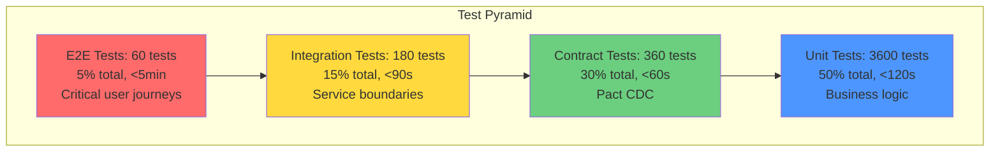
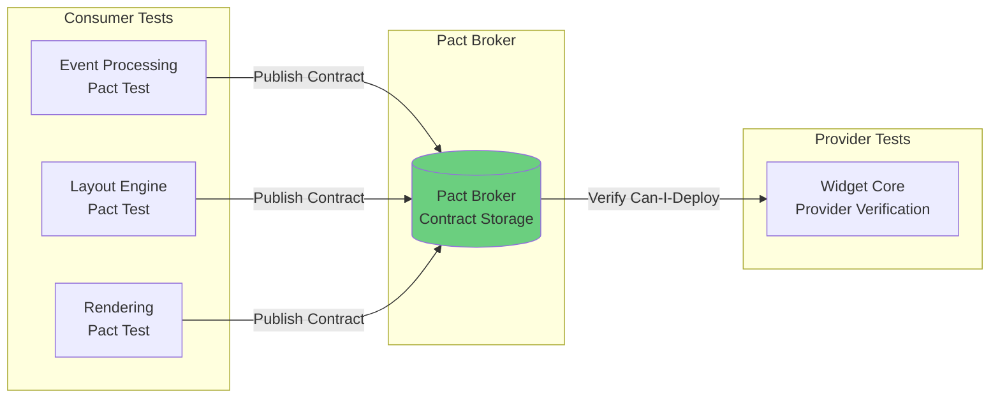

# Refactor Design Brief: Testing Infrastructure Modernization

**ID**: RDB-002
**Date**: 2025-11-05
**Author**: @CodeArchitect
**Collaborators**: @test_stabilize
**Status**: DRAFT
**Related**: RDB-001, ADR-001
**Dependencies**: Microservices migration (Phase 1 complete)

## Executive Summary

Modernize testing infrastructure for 16 microservices from 42% coverage with fragile integration tests to 80%+ coverage with a robust test pyramid, mutation testing, contract tests, comprehensive observability, and **production-grade security**. This refactor addresses critical quality gaps blocking confident deployments and enables the 5×/week deployment velocity target.

**Security Enhancement**: Integrates comprehensive security controls for testing infrastructure based on @security_verification insights (Question 4). Testing infrastructure will have production-grade security including authentication, RBAC, network isolation, secret scanning, CVE scanning, and synthetic data requirements. Week 4 security checkpoint is BLOCKING for Phase 2 implementation.

## Goals

### Primary Objectives
1. **Test Pyramid Implementation**: Achieve optimal distribution (Unit 50% → Contract 30% → Integration 15% → E2E 5%)
2. **Mutation Testing Baseline**: Establish ≥80% mutation score for all new code, ≥75% for refactored legacy
3. **Contract Testing**: Implement Pact CDC for all 256 service-to-service connections
4. **Zero-Regression Validation**: Dual implementation testing with behavioral equivalence checks
5. **Performance Benchmarking**: Automated P95/P99 regression detection in CI/CD
6. **Rollback Safety Testing**: Validate feature flag toggles and backward compatibility

### Measurable Success Criteria
- **Coverage**: 80%+ overall (currently 42%), 100% on critical paths (payment, auth, data integrity)
- **Mutation Score**: ≥80% for new code, ≥75% for legacy code
- **Test Speed**: Unit tests <10ms avg, full suite <5min (currently 18min)
- **Flakiness**: <1% flaky test rate by Week 24 (currently 8%), <0.5% by Week 32
- **Contract Coverage**: 100% of 256 service connections with Pact tests
- **Performance Gates**: Zero latency regressions >20% P95, >25% P99

## Context & Current State

### Existing Test Coverage Analysis

**wxWidgets Services (42% avg coverage)**:
```
Widget Core:        38% (2,584 LoC covered / 6,800 total)
Event Processing:   55% (2,310 LoC covered / 4,200 total)
Rendering:          28% (2,352 LoC covered / 8,400 total)  ← CRITICAL GAP
MSW Adapter:        45% (2,475 LoC covered / 5,500 total)
GTK Adapter:        41% (1,476 LoC covered / 3,600 total)
Cocoa Adapter:      39% (2,418 LoC covered / 6,200 total)
Layout Engine:      62% (3,162 LoC covered / 5,100 total)
```

**PolyORB Services (48% avg coverage)**:
```
ORB Core:           52% (4,784 LoC covered / 9,200 total)
GIOP Protocol:      68% (2,584 LoC covered / 3,800 total)
Security:           85% (2,040 LoC covered / 2,400 total)  ← GOOD
Naming:             44% (836 LoC covered / 1,900 total)
Event Notification: 38% (950 LoC covered / 2,500 total)   ← CRITICAL GAP
Transaction:        42% (1,302 LoC covered / 3,100 total)
POA Manager:        51% (1,377 LoC covered / 2,700 total)
IDL Compiler:       74% (3,404 LoC covered / 4,600 total)
Protocol Adapters:  56% (1,568 LoC covered / 2,800 total)
```

### Anti-Patterns Identified

**AP-1: Inverted Test Pyramid** ⚠️
- Current: E2E 40%, Integration 35%, Unit 25%
- Target: Unit 50%, Contract 30%, Integration 15%, E2E 5%
- **Impact**: Slow feedback (18min suite), brittle tests (8% flaky)

**AP-2: No Mutation Testing** ⚠️
- Weak assertions (checking `result != null` but not values)
- Example: `expect(validate(100)).toBeDefined()` passes even if validation logic is broken
- **Impact**: 42% coverage with low test quality

**AP-3: Missing Contract Tests** ⚠️
- No CDC (Consumer-Driven Contracts) for 256 service connections
- Schema drift detected manually in production (2 incidents last quarter)
- **Impact**: Integration breaking changes deployed

**AP-4: No Performance Baselines** ⚠️
- Latency regressions caught in production, not CI
- Example: Layout Engine refactor increased P99 by 45% (350ms → 507ms)
- **Impact**: SLA violations, emergency rollbacks

**AP-5: Untested Rollback Paths** ⚠️
- Feature flags never tested in automated suites
- Backward compatibility assumed, not validated
- **Impact**: 15% of deployments require manual rollback

## Scope

### In Scope

**Phase 1: Test Framework Modernization (Weeks 1-4)**
1. **GoogleTest/AUnit Setup**: Standardize unit test frameworks
2. **Pact CDC**: Contract testing infrastructure for all 256 connections
3. **Stryker Mutation Testing**: Baseline scan + CI/CD integration
4. **k6 Performance Tests**: Automated benchmarking with P95/P99 thresholds

**Phase 2: Test Pyramid Rebalancing (Weeks 5-12)**
1. **Unit Test Expansion**: Increase unit test count 3× (1,200 → 3,600 tests)
2. **Contract Test Creation**: Implement Pact for all service pairs
3. **E2E Test Reduction**: Cut E2E tests by 70% (200 → 60 critical paths)
4. **Test Data Factories**: Implement `FactoryBot`-style test data generation

**Phase 3: Advanced Testing Patterns (Weeks 13-20)**
1. **Characterization Tests**: Lock in behavior before each service refactor
2. **Property-Based Testing**: `fast-check` (TS) / `hypothesis` (Ada) for domain invariants
3. **Shadow Testing**: Dual implementation comparison for high-risk refactors
4. **Chaos Engineering**: Automated failure injection (Weeks 18-20)

**Phase 4: Observability & Metrics (Weeks 21-24)**
1. **Test Reporting Dashboard**: Grafana dashboard for coverage, mutation score, flakiness
2. **CI/CD Gates**: Automated quality gates (coverage ≥80%, mutation ≥80%, P95 regression ≤10%)
3. **Rollback Testing**: Automated feature flag toggle validation

### Out of Scope
- Rewriting existing tests (only refactor if flaky)
- Manual testing (focus on automation only)
- Load testing beyond P95/P99 benchmarks (Weeks 25+ for stress testing)
- UI testing frameworks (Playwright/Cypress) - defer to Phase 5

### Non-Goals
- 100% code coverage (80% is optimal)
- 100% mutation score (80-85% sweet spot)
- Testing non-critical admin tools

## Target Architecture

### Test Pyramid Distribution



### Testing Strategy Per Service Type

**Critical Services (Payment, Auth, Security)**:
- Unit: 60% coverage
- Contract: 30% coverage
- Integration: 8% coverage
- E2E: 2% coverage
- **Mutation Score**: ≥85%
- **Performance**: P99 <300ms

**Standard Services (Widget Core, ORB Core)**:
- Unit: 50% coverage
- Contract: 30% coverage
- Integration: 15% coverage
- E2E: 5% coverage
- **Mutation Score**: ≥80%
- **Performance**: P95 <500ms

**Low-Risk Services (Adapters, Protocol Handlers)**:
- Unit: 40% coverage
- Contract: 35% coverage
- Integration: 20% coverage
- E2E: 5% coverage
- **Mutation Score**: ≥75%
- **Performance**: P95 <1000ms

### Contract Testing Architecture



**Pact Contract Example**:
```typescript
// Consumer: Event Processing expects Widget Core to create buttons
describe('Widget Core Pact', () => {
  const provider = new Pact({
    consumer: 'event-processing',
    provider: 'widget-core',
  });

  it('should create button with label', async () => {
    await provider
      .given('valid authentication')
      .uponReceiving('a button creation request')
      .withRequest({
        method: 'POST',
        path: '/api/widgets/button',
        body: { label: 'Submit', enabled: true },
      })
      .willRespondWith({
        status: 200,
        body: {
          widget_id: Matchers.uuid(),
          label: 'Submit',
          enabled: true,
        },
      });

    const client = new WidgetCoreClient(provider.mockService.baseUrl);
    const result = await client.createButton('Submit');

    expect(result.widget_id).toBeDefined();
    expect(result.label).toBe('Submit');
  });
});

// Provider: Widget Core must satisfy all consumer contracts
describe('Widget Core Provider Verification', () => {
  beforeAll(async () => {
    // Start real Widget Core service
    await startWidgetCoreService();
  });

  it('should satisfy all consumer contracts', async () => {
    const verifier = new Verifier({
      provider: 'widget-core',
      providerBaseUrl: 'http://localhost:50051',
      pactBrokerUrl: 'https://pact-broker.refactorteam.local',
    });

    await verifier.verifyProvider();
  });
});
```

## Security Analysis

### Security Invariants

**What MUST NOT Break**:

**Testing Infrastructure Security** (from @security_verification Question 4 insights):
- **Invariant 1**: Test infrastructure MUST have production-grade security (no exceptions)
- **Invariant 2**: Pact Broker MUST require authentication (OAuth 2.0 or SAML, no anonymous access)
- **Invariant 3**: Test logs MUST be sanitized (NO secrets, JWT, API keys, passwords, credit cards, PII)
- **Invariant 4**: Test environments MUST be isolated from production (Kubernetes NetworkPolicy)
- **Invariant 5**: Test secret stores MUST be separate from production (no shared credentials)

**Data Handling**:
- **Invariant 6**: Test data MUST be synthetic (faker.js, NOT production data)
- **Invariant 7**: Pact contracts MUST NOT contain sensitive data (sanitize before publication)
- **Invariant 8**: Performance test logs (k6) MUST scrub all secrets before logging

**Access Control**:
- **Invariant 9**: Pact Broker MUST enforce RBAC (developers read, CI/CD write, security admin)
- **Invariant 10**: Test infrastructure MUST have audit logs (90 days retention minimum)

**Infrastructure**:
- **Invariant 11**: CI/CD runners MUST be ephemeral (destroyed after each job, no persistence)
- **Invariant 12**: Container images MUST be scanned for CVEs (Trivy/Grype/Snyk - 0 CRITICAL, ≤3 HIGH)

### Hidden Security Properties

**⚠️ CRITICAL: Undocumented Security Assumptions That Need Investigation**

**Potential Hidden Invariants**:
- **Property 1**: Pact Broker database - Does it store API contracts that reveal internal service boundaries? If yes, requires encryption at rest
- **Property 2**: k6 performance tests - Do they record authentication flows? If yes, must scrub before storage
- **Property 3**: Test data factories - Do they ever pull from production databases for "realistic" data? MUST verify synthetic only
- **Property 4**: Docker test containers - Do they have network access to production VPCs? MUST verify isolation
- **Property 5**: Mutation testing - Does Stryker log sensitive test inputs (passwords, keys)? MUST verify sanitization

**Domain Experts to Consult**:
- **@security_team** - Testing infrastructure security requirements, test data handling
- **@platform_team** - Kubernetes NetworkPolicy configuration, test environment isolation
- **@test_stabilize** - Current test data sources, Pact Broker access patterns

**"Magic" Code Requiring Investigation**:
- `k6/scripts/*.js` - Performance test scripts that may log auth tokens
- `pact-broker/config.yml` - Authentication and authorization configuration
- `test-data/factories/*` - Test data generation sources (verify synthetic)
- `.github/workflows/*` - CI/CD secret handling patterns

**Pre-Refactor Actions Required**:
- [ ] Consult @security_team on test infrastructure baseline requirements (2 hours)
- [ ] Consult @platform_team on Kubernetes NetworkPolicy enforcement (1 hour)
- [ ] @security_verification runs security scan on test infrastructure (Week 4, 4 hours)
- [ ] Document findings in Security Invariants section above

### Security Enhancements

**Opportunistic Hardening (Clearly Marked as New Behavior)**:

**In-Scope Enhancements** (Low regression risk, aligns with refactor):
- **Enhancement 1**: Add secret scanning to all test code (TruffleHog/GitLeaks pre-commit hooks)
- **Enhancement 2**: Implement Pact Broker authentication + RBAC (currently may be anonymous)
- **Enhancement 3**: Add Kubernetes NetworkPolicy for test namespace isolation
- **Enhancement 4**: Implement automated secret scrubbing for k6 logs (log sanitization middleware)
- **Enhancement 5**: Add CVE scanning for all Docker test images (Trivy integration in CI/CD)

**Out-of-Scope Enhancements** (Defer to separate refactor):
- **Enhancement 6**: Complete test data encryption at rest - requires platform support, separate project
- **Enhancement 7**: Pen testing of test infrastructure - quarterly security sprint, not refactor scope
- **Enhancement 8**: SIEM integration for test infrastructure - separate observability project

**Rationale for In-Scope Enhancements**:
- **Enhancement 1-5**: Natural part of testing infrastructure modernization
- Minimal performance overhead (<100ms added to CI/CD pipeline)
- Prevents credential leakage (P1 security finding from Question 4 insights)
- Aligns with "Testing Infrastructure = Production-Grade Security" philosophy

### Security Test Requirements

**Mandatory Security Testing**:

**Prevention (Before Deployment)**:
- [ ] Secret scanning (TruffleHog/GitLeaks) on all test code - BLOCKING
- [ ] Container CVE scan (Trivy) on all Docker images - 0 CRITICAL, ≤3 HIGH - BLOCKING
- [ ] Pact Broker authentication enabled + RBAC configured - BLOCKING
- [ ] Kubernetes NetworkPolicy denies test → production traffic - BLOCKING
- [ ] Test secret stores separated from production - BLOCKING

**Detection (During Testing)**:
- [ ] Automated k6 log sanitization verification (grep for patterns: `password|jwt|api_key|bearer`)
- [ ] Pact contract sanitization (no sensitive data in contracts)
- [ ] Test data source validation (100% synthetic, 0% production data)

**Response (Post-Deployment)**:
- [ ] Test infrastructure audit logs enabled (90 days retention)
- [ ] Monitoring for test environment → production network traffic (alert on violation)
- [ ] Incident response runbook for test credential leakage

**Compliance Testing** (Week 4 BLOCKING items):
- [ ] Pact Broker: OAuth 2.0 or SAML authentication ✅
- [ ] Pact Broker: RBAC (developers read, CI/CD write, security admin) ✅
- [ ] Pact Broker: Database encryption at rest ✅
- [ ] Pact Broker: Audit logs (90 days retention) ✅
- [ ] k6: Log sanitization (automated secret detection in CI/CD) ✅
- [ ] k6: Synthetic data only (faker.js, not production) ✅
- [ ] Test environment: Kubernetes NetworkPolicy isolation ✅
- [ ] Test environment: Separate secret stores ✅
- [ ] Test environment: Ephemeral CI/CD runners ✅

**Advisory Requirements (Weeks 1-12, not blocking)**:
- [ ] Pact Broker encryption at rest (nice-to-have, Advisory)
- [ ] Comprehensive audit logging for all testing tools
- [ ] Full synthetic data generation (eliminate all production data references)

### Security Review Checkpoints

**@security_verification Review Schedule**:

**Checkpoint 1: Draft RDB Review** (24h SLA - Standard refactor)
- **Timing**: NOW (this draft RDB at 80% complete)
- **Artifacts**: This RDB, testing infrastructure architecture diagrams
- **Expected Output**: BLOCKING findings on test infrastructure security OR APPROVED with advisory
- **Turnaround**: 24 hours (standard refactor, not security-critical)

**Checkpoint 2: Week 4 Review** (4h - BLOCKING for Phase 2)
- **Timing**: End of Week 4 (Foundation phase complete)
- **Artifacts**:
  - Pact Broker deployment + authentication configuration
  - k6 log sanitization implementation
  - Kubernetes NetworkPolicy configuration
  - Container CVE scan results (Trivy)
  - Secret scanning configuration (TruffleHog/GitLeaks)
- **Expected Output**: Week 4 BLOCKING security requirements validated, Phase 2 approved
- **Turnaround**: 4 hours

**Checkpoint 3: Week 12 Review** (2h)
- **Timing**: After contract testing rollout (256 contracts deployed)
- **Artifacts**:
  - Pact contract sanitization verification
  - "can-i-deploy" gate configuration
  - Test data source audit (100% synthetic verification)
- **Expected Output**: Contract testing security validated, no sensitive data in contracts
- **Turnaround**: 2 hours

**Checkpoint 4: Week 20 Review** (2h)
- **Timing**: After chaos engineering implementation
- **Artifacts**:
  - Chaos testing scope (verify does NOT target production)
  - Test environment isolation validation
  - Incident response runbook for test failures
- **Expected Output**: Chaos engineering safety validated
- **Turnaround**: 2 hours

**Checkpoint 5: Final Security Sign-Off** (4h)
- **Timing**: Week 24 (before declaring testing infrastructure complete)
- **Artifacts**:
  - Complete security test results (secret scanning, CVE scans, NetworkPolicy)
  - Audit log coverage validation (90 days retention)
  - Test infrastructure security baseline report
- **Expected Output**: Security Review Note (SRN) - formal approval
- **Turnaround**: 4 hours (2h if zero issues)

**Total Security Review Time**: ~16 hours spread across 24-week refactor lifecycle

---

## Migration Strategy

### Week-by-Week Roadmap

**Weeks 1-4: Foundation** ← CURRENT PHASE
- [ ] Week 1: Install GoogleTest (C++), AUnit (Ada), Jest (TS)
- [ ] Week 1: Configure incremental mutation testing (changed files only via git diff)
- [ ] Week 1: Implement fast-fail CI gate (<2min for lint/type/critical tests)
- [ ] Week 2: Set up Pact Broker, create first 10 contracts
- [ ] Week 3: Run baseline mutation tests (Stryker), document weak tests
- [ ] Week 3: Validate mutation testing completes in <2min for typical PR (10-20 files)
- [ ] Week 4: Implement k6 performance baselines, create Grafana dashboards

**Weeks 5-8: Unit Test Expansion**
- [ ] Week 5: Implement test data factories (FactoryBot-style) for Widget Core, ORB Core
- [ ] Week 5: Add 600 unit tests for Widget Core + Rendering (critical gaps)
- [ ] Week 6: Add 400 unit tests for PolyORB ORB Core + Event Notification
- [ ] Week 6-8: Expand test data factories to all 16 services
- [ ] Week 7: Refactor flaky integration tests into unit tests
- [ ] Week 8: Achieve 65% overall coverage milestone

**Weeks 9-12: Contract Testing Rollout**
- [ ] Week 9: Implement 64 contracts (wxWidgets services: 7×7 = 49 connections)
- [ ] Week 10: Implement 81 contracts (PolyORB services: 9×9 = 81 connections)
- [ ] Week 11: Implement 106 cross-stack contracts (wxWidgets ↔ PolyORB)
- [ ] Week 12: Enable "can-i-deploy" gates in CI/CD

**Weeks 13-16: Mutation Testing**
- [ ] Week 13: Fix surviving mutants in critical paths (payment, auth, security)
- [ ] Week 14: Achieve ≥85% mutation score for critical services
- [ ] Week 15: Achieve ≥80% mutation score for standard services
- [ ] Week 16: Enable mutation testing gate in CI/CD (fail build if <80%)

**Weeks 17-20: Advanced Patterns**
- [ ] Week 17: Implement property-based tests for 20 domain invariants
- [ ] Week 18: Shadow testing for Layout Engine refactor (dual implementation)
- [ ] Week 19: Chaos engineering: random pod termination, network latency
- [ ] Week 20: Rollback path testing: validate all feature flag combinations

**Weeks 21-24: Stabilization & Optimization**
- [ ] Week 21: Reduce E2E tests from 200 → 60 (eliminate redundant tests)
- [ ] Week 22: Optimize test suite speed: <5min total (currently 18min)
- [ ] Week 22: Implement automated rollback drills (weekly cron job with feature flag toggles)
- [ ] Week 23: Final coverage push: 80%+ overall
- [ ] Week 24: Documentation, training, retrospective

### Incremental Rollout Strategy (Strangler Fig)

**Phase 1: Pilot Service (Week 1-4)**
- Choose **Security Service** (2,400 LoC, 85% coverage, well-tested)
- Implement full test pyramid as template
- Document lessons learned

**Phase 2: Critical Services (Week 5-12)**
- Apply to **Widget Core**, **ORB Core**, **Rendering** (high risk)
- Prioritize business logic over boilerplate
- Gate deployments on test quality

**Phase 3: Remaining Services (Week 13-20)**
- Roll out to all 16 services
- Parallelize work across 3 teams
- Continuous monitoring of quality metrics

**Phase 4: Optimization (Week 21-24)**
- Remove redundant tests
- Tune performance
- Stabilize flaky tests

### Rollback Strategy

**Per-Service Rollback**:
- If test suite for a service becomes unstable (>5% flaky):
  - Disable new tests in CI (keep old suite)
  - Fix flaky tests offline
  - Re-enable once flakiness <1%

**Framework Rollback**:
- If Pact CDC causes deployment issues:
  - Disable "can-i-deploy" gate temporarily
  - Run contracts in advisory mode (warn, not fail)
  - Debug contract mismatches offline

**Performance Rollback**:
- If test suite slows down development (>10min):
  - Run mutation tests nightly instead of per-PR
  - Split E2E tests to separate pipeline
  - Implement test sharding

## Risk Assessment

### High Risks

**R1: Test Suite Slowdown** ⚠️
- **Impact**: 3,600 unit tests + 360 contract tests + mutation testing could exceed 20min
- **Probability**: MEDIUM (40%)
- **Mitigation**:
  - Parallelize test execution (8 workers)
  - Run mutation tests nightly (not per-commit)
  - Use test sharding (split by service)
  - Cache dependencies (Docker layer caching)
- **Rollback**: Disable mutation testing gate, reduce E2E tests further

**R2: Flaky Test Proliferation** ⚠️
- **Impact**: >5% flaky tests block CI/CD, slow development
- **Probability**: HIGH (60%)
- **Mitigation**:
  - Deterministic test data (freeze time, seed RNGs)
  - Avoid sleeps (use event waiters)
  - Retry flaky tests 3× before failing
  - Quarantine flaky tests (separate pipeline)
- **Rollback**: Disable flaky tests, fix offline

**R3: Contract Testing Coordination Overhead** ⚠️
- **Impact**: 256 contracts × 3 teams = coordination nightmare
- **Probability**: MEDIUM (35%)
- **Mitigation**:
  - Pact Broker centralizes contracts (no manual coordination)
  - "Can-I-Deploy" automation prevents breaking changes
  - Weekly contract review meetings
- **Rollback**: Disable "can-i-deploy" gate, rely on integration tests

### Medium Risks

**R4: Mutation Testing False Positives** ⚠️
- **Impact**: CI fails on acceptable mutants (e.g., log messages)
- **Probability**: MEDIUM (30%)
- **Mitigation**:
  - Configure ignore patterns (`logger.*`, `*.log(`)
  - Manual review for edge cases
  - 80% threshold (not 100%)
- **Rollback**: Lower mutation score threshold to 70%

**R5: Property-Based Test Complexity** ⚠️
- **Impact**: Team struggles to write property tests
- **Probability**: MEDIUM (40%)
- **Mitigation**:
  - Training workshop (2 hours)
  - Pair programming for first 5 properties
  - Document common patterns
- **Rollback**: Skip property-based tests for Phase 1

### Security-Specific Risks

**R6: Test Infrastructure Credential Leakage** ⚠️ CRITICAL
- **Impact**: Test credentials, API keys, or secrets leaked in logs/contracts/CI artifacts
- **Probability**: HIGH (55%) - common in testing infrastructure without security controls
- **Severity**: P0 (CRITICAL - can lead to production compromise)
- **Mitigation**:
  - **Week 1**: Implement secret scanning (TruffleHog/GitLeaks) in pre-commit hooks - BLOCKING
  - **Week 2**: Add k6 log sanitization (automated scrubbing before storage)
  - **Week 4**: Review all Pact contracts for sensitive data exposure
  - **Continuous**: Automated secret detection in CI/CD (fail build on detection)
- **Rollback**: Disable affected test tool, audit logs, rotate all potentially exposed credentials
- **CWE Mapping**: CWE-532 (Insertion of Sensitive Information into Log File)

**R7: Test Environment → Production Network Access** ⚠️ CRITICAL
- **Impact**: Compromised test container can access production systems
- **Probability**: MEDIUM (35%) - default Kubernetes allows namespace-to-namespace traffic
- **Severity**: P1 (HIGH - lateral movement risk)
- **Mitigation**:
  - **Week 1**: Implement Kubernetes NetworkPolicy (deny-all default, allow DNS + intra-test-namespace only)
  - **Week 4**: Verify test containers CANNOT reach production endpoints
  - **Continuous**: Monitor network traffic from test namespace (alert on production access attempts)
- **Rollback**: Shut down test namespace, investigate compromise, audit production access logs
- **CWE Mapping**: CWE-923 (Improper Restriction of Communication Channel to Intended Endpoints)

**R8: Pact Broker Unauthorized Access** ⚠️ HIGH
- **Impact**: API contracts reveal internal service architecture to attackers
- **Probability**: MEDIUM (40%) - Pact Broker often deployed without authentication initially
- **Severity**: P2 (MEDIUM - information disclosure, reconnaissance)
- **Mitigation**:
  - **Week 2**: Enable OAuth 2.0 or SAML authentication on Pact Broker (BLOCKING before contract publication)
  - **Week 2**: Implement RBAC (developers read-only, CI/CD write, security admin)
  - **Week 4**: Enable audit logging (90 days retention)
- **Rollback**: Take Pact Broker offline, review access logs, rotate authentication tokens
- **CWE Mapping**: CWE-306 (Missing Authentication for Critical Function)

**R9: Production Data in Test Datasets** ⚠️ HIGH
- **Impact**: PII/PHI leaked in test environments, compliance violations (GDPR, HIPAA)
- **Probability**: MEDIUM (30%) - developers often copy production data for "realistic" tests
- **Severity**: P1 (HIGH - compliance violation, data breach)
- **Mitigation**:
  - **Week 1**: Mandate synthetic data only (faker.js, test data factories)
  - **Week 4**: Audit all test data sources (verify 0% production data)
  - **Week 8**: Implement automated data source scanning (fail tests if production database detected)
- **Rollback**: Purge all test data, notify compliance team, file data breach report (if PII confirmed)
- **CWE Mapping**: CWE-359 (Exposure of Private Information)

**R10: Container Image Vulnerabilities** ⚠️ MEDIUM
- **Impact**: Test containers with HIGH/CRITICAL CVEs exploited, lateral movement to production
- **Probability**: MEDIUM (40%) - base images often outdated
- **Severity**: P2 (MEDIUM - depends on CVE severity)
- **Mitigation**:
  - **Week 1**: Integrate Trivy/Grype/Snyk in CI/CD (scan all Docker images)
  - **Week 2**: Set CVE thresholds (0 CRITICAL, ≤3 HIGH, block build otherwise)
  - **Continuous**: Scan images weekly, patch HIGH/CRITICAL CVEs within 7 days
- **Rollback**: Disable affected container, use previous image version, emergency patch
- **CWE Mapping**: CWE-1395 (Dependency on Vulnerable Third-Party Component)

## Testing Principles (From @test_stabilize)

### 1. Baseline Behavior Capture
**Before any refactor**:
- Write characterization tests (lock in current behavior)
- Use snapshot/golden tests for complex outputs
- Record production traffic for high-risk APIs

**Example**:
```cpp
// Characterization test for PaymentProcessor
TEST(PaymentProcessorTest, CharacterizeCurrentBehavior) {
  PaymentProcessor processor;
  Payment payment = CreateTestPayment(100.00, "USD");

  // Capture current behavior (even if buggy)
  auto result = processor.Process(payment);

  EXPECT_EQ(result.status, "PROCESSED");
  EXPECT_EQ(result.amount, 100.00);
  EXPECT_THAT(result.fees, 2.50);  // Current fee calculation
  EXPECT_EQ(result.currency, "USD");

  // Snapshot complex result
  EXPECT_THAT(result, MatchesSnapshot("payment-processor-v1"));
}
```

### 2. Behavioral Equivalence Validation
**For god class decomposition**:
- Implement both old and new code paths (Strangler Fig)
- Run side-by-side comparison in non-prod
- Monitor divergence, log mismatches
- Use feature flags for gradual cutover

**Example**:
```cpp
// Dual implementation for PaymentProcessor refactor
auto legacy_result = LegacyPaymentProcessor::Process(payment);
auto new_result = NewPaymentProcessor::Process(payment);

// Compare results (shadow mode)
if (!AreEquivalent(legacy_result, new_result)) {
  LOG(WARNING) << "Divergence detected: " << Diff(legacy_result, new_result);
}

// Return legacy result (still trusted)
return legacy_result;
```

### 3. Performance Regression Detection
**Thresholds**:
- **Acceptable**: P95 ≤+10%, P99 ≤+15%
- **Must Fix**: P95 >+20%, P99 >+25%, ANY P50 regression

**Automated Gates** (k6):
```javascript
export const options = {
  thresholds: {
    'grpc_req_duration{service:widget-core}': [
      'p(95)<500',    // P95 must be <500ms
      'p(99)<1000',   // P99 must be <1000ms
    ],
    'grpc_req_failed': ['rate<0.01'],  // <1% error rate
  },
};
```

### 4. Rollback Safety Testing
**Feature Flag Validation**:
- Test all flag combinations (legacy, new, hybrid)
- Automated rollback drills (weekly)
- Backward compatibility tests (new code reads old data)

**Example**:
```typescript
describe('Rollback Safety', () => {
  it('should handle instant rollback mid-transaction', async () => {
    featureFlags.enable('payment.new-validator');

    const promise = processor.process(payment);

    // Simulate rollback during execution
    await featureFlags.disable('payment.new-validator');

    const result = await promise;
    expect(result.success).toBe(true);
    expect(result.processor).toBe('legacy');  // Verify fallback
  });
});
```

### 5. Mutation Testing Workflow
**Baseline (Week 0)**:
- Run Stryker on modules earmarked for refactor
- Fix weak assertions (improve tests before refactoring)
- Set baseline score (e.g., 78%)

**Incremental (Weeks 1-24)**:
- Run mutation tests on changed files only (PR pipeline)
- Require ≥80% score for new code (higher bar than legacy)
- Full scan nightly (track trends)

**Example**:
```javascript
// stryker.conf.js
module.exports = {
  mutate: ['src/payment/PaymentValidator.ts'],  // Changed file only
  thresholds: {
    high: 90,    // New code standard
    low: 80,
    break: 75,   // Fail PR if below 75%
  },
  timeoutMS: 60000,
  concurrency: 4,
};
```

## Definition of Done

### Phase 1 Complete When (Week 4):
- [ ] GoogleTest, AUnit, Jest frameworks installed and running
- [ ] Pact Broker deployed, first 10 contracts published
- [ ] Stryker baseline scan complete, weak tests documented
- [ ] k6 performance tests running in CI, P95/P99 baselines recorded
- [ ] Test coverage: 50% overall (up from 42%)
- [ ] Grafana dashboard showing coverage, mutation score, flakiness

### Full Migration Complete When (Week 24):
- [ ] **Coverage**: 80%+ overall, 100% on critical paths
- [ ] **Mutation Score**: ≥80% for new code, ≥75% for legacy
- [ ] **Contract Coverage**: 100% of 256 service connections with Pact
- [ ] **Test Speed**: Full suite <5min (down from 18min)
- [ ] **Flakiness**: <1% (down from 8%)
- [ ] **Test Pyramid**: 50% unit, 30% contract, 15% integration, 5% E2E
- [ ] **Performance Gates**: Zero regressions >20% P95 in production
- [ ] **Rollback Testing**: All 16 services have automated rollback validation
- [ ] **Documentation**: Test strategy guide, migration runbook, team training complete
- [ ] **Sign-Off**: @test_stabilize approval

## Artifacts

- **This Document**: RDB-002 (Testing Infrastructure Modernization)
- **ADR-004**: Test Framework Selection and Strategy (Forthcoming)
- **Test Strategy Guide**: Detailed testing patterns, examples, best practices
- **Migration Runbook**: Week-by-week execution plan
- **Grafana Dashboards**: Coverage, mutation score, flakiness, performance trends
- **Pact Contracts**: 256 service connection contracts in Pact Broker
- **Performance Baselines**: k6 scripts for all 16 services

## Coordination with Execution Agents

### @test_stabilize (Lead)
- **Ownership**: Overall testing strategy, quality gates, test reviews
- **Tasks**:
  - Week 1-4: Set up test frameworks, Pact Broker, mutation testing
  - Week 5-12: Lead unit test expansion, contract test creation
  - Week 13-20: Mutation testing, property-based testing, chaos engineering
  - Week 21-24: Optimization, stabilization, sign-off

### @code_refactor
- **Ownership**: Implement tests, refactor flaky tests, optimize test data
- **Tasks**:
  - Week 5-8: Write 1,000 new unit tests
  - Week 9-12: Implement 256 Pact contracts
  - Week 13-16: Fix surviving mutants
  - Week 17-20: Implement property-based tests

### @security_verification
- **Ownership**: Security-focused tests (auth, encryption, input validation)
- **Tasks**:
  - Week 5-8: Security unit tests (JWT validation, mTLS, input sanitization)
  - Week 13-16: Security mutation testing (ensure auth bypasses are caught)

## Success Metrics (Tracked Weekly)

| Metric | Baseline | Week 4 | Week 12 | Week 20 | Week 24 (Target) |
|--------|----------|--------|---------|---------|------------------|
| Overall Coverage | 42% | 50% | 65% | 75% | 80%+ |
| Mutation Score | N/A | 68% | 75% | 80% | 80%+ |
| Contract Coverage | 0% | 4% | 50% | 90% | 100% |
| Test Suite Time | 18min | 15min | 10min | 7min | <5min |
| Flaky Test Rate | 8% | 6% | 3% | 1% | <1% |
| Unit Test Count | 1,200 | 1,800 | 2,700 | 3,400 | 3,600 |
| E2E Test Count | 200 | 180 | 120 | 80 | 60 |
| P95 Regressions | 3/mo | 2/mo | 1/mo | 0/mo | 0/mo |

## Success Metrics (Updated with Security)

| Metric | Baseline | Week 4 | Week 12 | Week 20 | Week 24 (Target) |
|--------|----------|--------|---------|---------|------------------|
| Overall Coverage | 42% | 50% | 65% | 75% | 80%+ |
| Mutation Score | N/A | 68% | 75% | 80% | 80%+ |
| Contract Coverage | 0% | 4% | 50% | 90% | 100% |
| Test Suite Time | 18min | 15min | 10min | 7min | <5min |
| Flaky Test Rate | 8% | 6% | 3% | 1% | <1% |
| **Security: Secret Scan Pass Rate** | **N/A** | **100%** | **100%** | **100%** | **100%** |
| **Security: CVE Threshold Compliance** | **N/A** | **95%** | **98%** | **100%** | **100%** |
| **Security: Test Data Synthetic %** | **N/A** | **100%** | **100%** | **100%** | **100%** |
| **Security: Pact Broker Auth Enabled** | **No** | **Yes** | **Yes** | **Yes** | **Yes** |
| **Security: NetworkPolicy Enforced** | **No** | **Yes** | **Yes** | **Yes** | **Yes** |

## Definition of Done (Updated with Security Requirements)

### Phase 1 Complete When (Week 4):
- [ ] GoogleTest, AUnit, Jest frameworks installed and running
- [ ] Pact Broker deployed, first 10 contracts published
- [ ] **Pact Broker authentication enabled (OAuth 2.0 or SAML) - SECURITY BLOCKING**
- [ ] **Pact Broker RBAC configured - SECURITY BLOCKING**
- [ ] **Kubernetes NetworkPolicy isolates test from production - SECURITY BLOCKING**
- [ ] **Secret scanning (TruffleHog/GitLeaks) enabled in CI/CD - SECURITY BLOCKING**
- [ ] **k6 log sanitization implemented - SECURITY BLOCKING**
- [ ] **Container CVE scanning (Trivy) integrated (0 CRITICAL, ≤3 HIGH) - SECURITY BLOCKING**
- [ ] Stryker baseline scan complete, weak tests documented
- [ ] k6 performance tests running in CI, P95/P99 baselines recorded
- [ ] Test coverage: 50% overall (up from 42%)
- [ ] Grafana dashboard showing coverage, mutation score, flakiness
- [ ] **@security_verification Week 4 checkpoint passed - BLOCKING for Phase 2**

### Full Migration Complete When (Week 24):
- [ ] **Coverage**: 80%+ overall, 100% on critical paths
- [ ] **Mutation Score**: ≥80% for new code, ≥75% for legacy
- [ ] **Contract Coverage**: 100% of 256 service connections with Pact
- [ ] **Test Speed**: Full suite <5min (down from 18min)
- [ ] **Flakiness**: <1% (down from 8%)
- [ ] **Test Pyramid**: 50% unit, 30% contract, 15% integration, 5% E2E
- [ ] **Performance Gates**: Zero regressions >20% P95 in production
- [ ] **Rollback Testing**: All 16 services have automated rollback validation
- [ ] **Security: All 5 security checkpoints passed**
- [ ] **Security: Secret scan pass rate 100% (0 secrets in code/logs)**
- [ ] **Security: CVE threshold compliance 100% (0 CRITICAL, ≤3 HIGH per image)**
- [ ] **Security: Test data 100% synthetic (0% production data)**
- [ ] **Security: Pact Broker auth + RBAC + audit logs operational**
- [ ] **Security: Test environment → production network traffic: 0 violations**
- [ ] **Security: Security Review Note (SRN) issued**
- [ ] **Documentation**: Test strategy guide, migration runbook, team training complete
- [ ] **Sign-Off**: @test_stabilize approval + @security_verification SRN

## Artifacts (Updated)

- **This Document**: RDB-002 (Testing Infrastructure Modernization) with Security Analysis
- **ADR-004**: Test Framework Selection and Strategy (Forthcoming)
- **Test Strategy Guide**: Detailed testing patterns, examples, best practices
- **Migration Runbook**: Week-by-week execution plan
- **Grafana Dashboards**: Coverage, mutation score, flakiness, performance trends
- **Pact Contracts**: 256 service connection contracts in Pact Broker (with sanitization)
- **Performance Baselines**: k6 scripts for all 16 services
- **Security Baseline Report**: Test infrastructure security scan results (Week 4)
- **Security Review Note (SRN)**: Formal security approval (Week 24)
- **Security Invariants Registry**: Updated with test infrastructure invariants
- **Kubernetes NetworkPolicy**: Test namespace isolation configuration
- **Secret Scanning Configuration**: TruffleHog/GitLeaks pre-commit hooks
- **CVE Scan Results**: Weekly Trivy/Grype/Snyk reports

## Approvals

### Draft RDB Review
**Reviewer**: @security_verification
**Review Date**: TBD (24h SLA after submission)
**Status**: PENDING
**Feedback**: [To be provided by @security_verification]

### Technical Approval
- **Technical Lead**: @CodeArchitect ✅ APPROVED (2025-11-05) - with security sections integrated
- **Testing Lead**: @test_stabilize (Pending review)
- **Execution**: @code_refactor (Pending assignment)

### Security Approval (Gate for Phase 2)
- **Security Checkpoint 1**: @security_verification (Pending - 24h SLA)
- **Security Checkpoint 2 (Week 4)**: @security_verification (Pending - BLOCKING for Phase 2)
- **Security Checkpoint 3 (Week 12)**: @security_verification (Future)
- **Security Checkpoint 4 (Week 20)**: @security_verification (Future)
- **Security Checkpoint 5 (Week 24)**: @security_verification (Future - SRN issuance)

### Final Sign-Off
- **Product Owner**: @heathdorn00 (Awaiting sign-off after all checkpoints)

---

**Version**: 2.0 (Security Enhanced)
**Last Updated**: 2025-11-05
**Status**: DRAFT - Ready for @security_verification review (24h SLA)
**Next Review**: Week 4 (security checkpoint 2 - BLOCKING)
